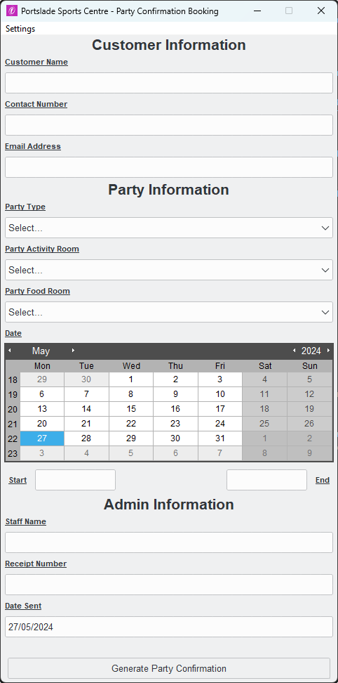
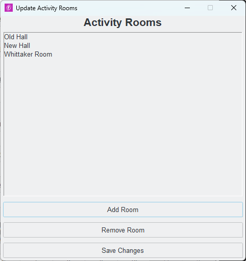
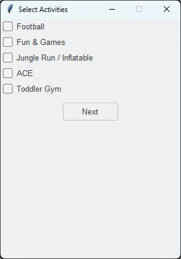
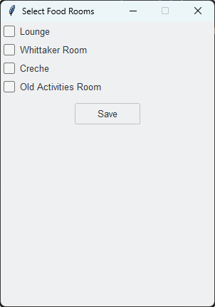
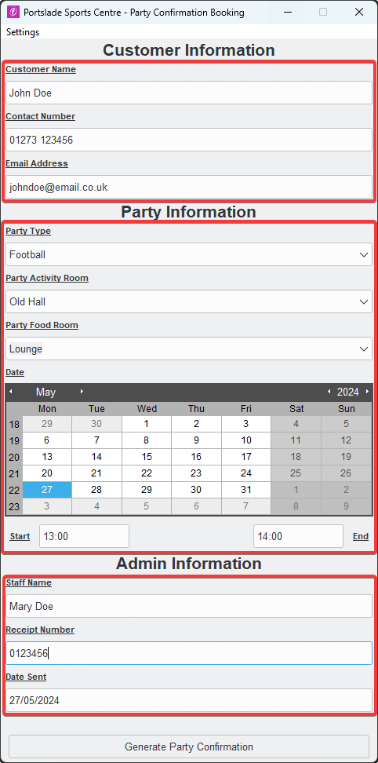

# Party Booking Confirmation Generator

## How It Works?

`Generate Party Confirmation` will scan the assign Word Template and replace key words with information presented in the application. This will recreate the existing template with the populated information, assigning a customer name and party type to the newly created document.

Entry Points will reset so that users do not need to re-open the application, speeding up the generation process. Flexible Activity Rooms allows flexibility for all sites.

## Screenshots

### Entry Point

### Flexible Activity Rooms

### Assign Activities To Newly Created Rooms

### Assign Food Rooms To Newly Created Rooms

### Structured Layout

# TODO:

- Update GUI.
- Restructure Party/Activity/Food Room layout.
- Stop using JSON to store edited data - Local Storage?